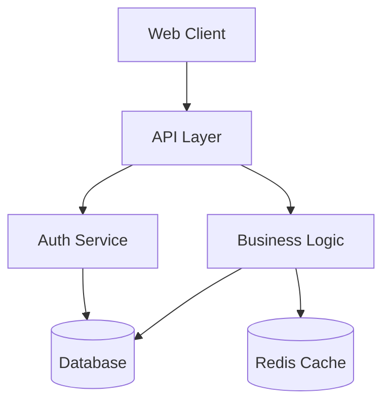
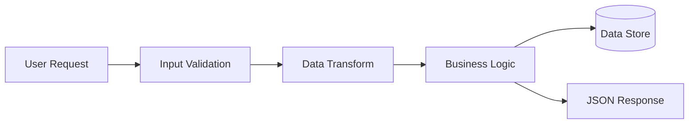
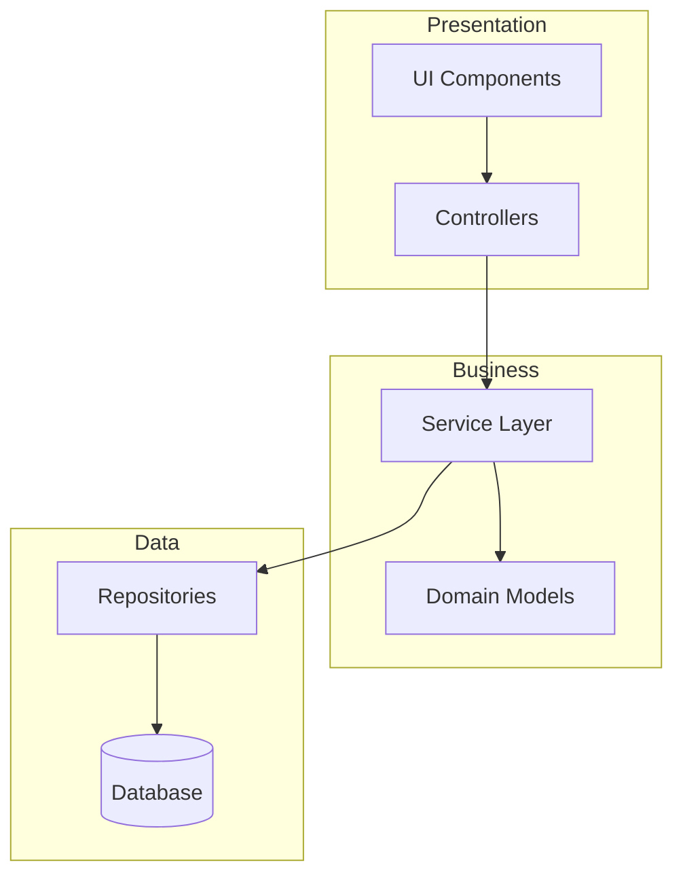
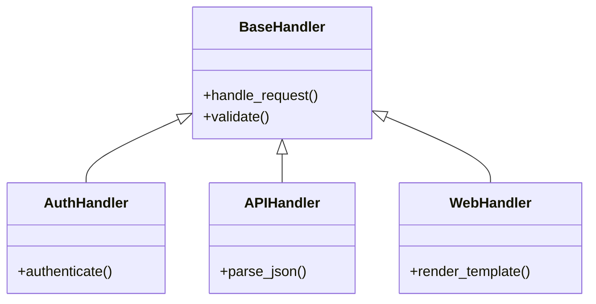
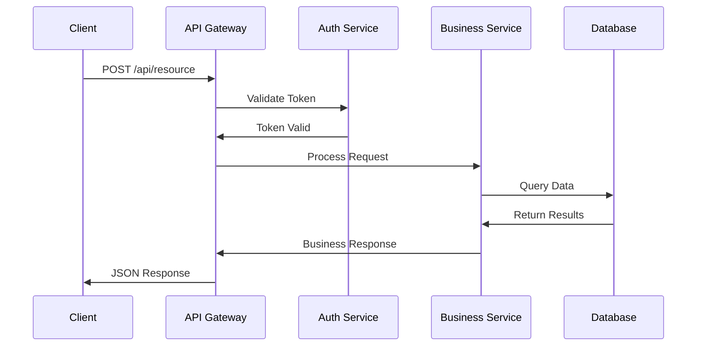

# Architecture Analyzer

## Overview

This skill provides comprehensive architectural analysis through an iterative, dialog-driven approach. Rather than jumping directly into code details, it guides users from broad architectural understanding to specific areas of interest through structured conversation and visual diagrams.

The analysis examines code in the context of its language idioms, framework conventions, and intended purpose, comparing implementations against known design patterns and anti-patterns. The focus is on explaining the current design with insightful observations that help users make informed decisions about their architecture.

## Analysis Workflow

Follow this five-phase approach to conduct thorough architectural analysis:

### Phase 1: Establish Context

Begin with dialog to understand the user's needs and set appropriate scope:

**Key questions to ask:**
- What is the purpose/domain of this software? (e.g., web API, CLI tool, data pipeline)
- What are you trying to understand or evaluate? (e.g., "how authentication works", "overall structure", "data flow")
- What specific concerns do you have? (e.g., scalability, maintainability, technical debt)
- What scope should we focus on? (e.g., entire codebase, specific subsystem, particular feature)

**Examples of context-setting dialog:**
- User: "I inherited this codebase and need to understand it"
  → Ask: What will you be working on? What's the business domain? Any known pain points?

- User: "Is our architecture good?"
  → Ask: What are your concerns? Performance? Maintainability? Are you planning changes?

- User: "How does feature X work?"
  → Ask: Are you trying to modify it, debug it, or just understand it? Do you know what files are involved?

### Phase 2: Broad Examination

Start with high-level architectural understanding before diving into specifics:

**Examine in order:**
1. **Language & ecosystem** - What language? What version? What are the idioms?
2. **Frameworks & libraries** - Core dependencies? Framework patterns being used?
3. **Repository organization** - Directory structure? Module/package layout? Separation of concerns?
4. **Entry points** - Where does execution begin? What are the main interfaces?
5. **Major components** - What are the top-level architectural pieces? How do they relate?
6. **Data flow** - How does data move through the system? What are the boundaries?
7. **Configuration & environment** - How is the system configured? What's externalized?

**Tools to use:**
- Read directory structure and key files (README, package.json, setup.py, etc.)
- Examine entry points (main.py, index.js, app.js, cmd/main.go, etc.)
- Review configuration files to understand capabilities and dependencies
- Look at top-level directories to understand modular organization

**Provide observations like:**
- "This is a Django web application with a typical MTV (Model-Template-View) structure"
- "The codebase follows a microservices pattern with 5 main services communicating via REST"
- "This appears to be a monolithic architecture with business logic mixed into controllers - consider a service layer"
- "The project uses dependency injection via a DI container, which is good for testability"

### Phase 3: Visual Representation

Create appropriate diagrams to illustrate architectural findings. Use text-based formats (primarily Mermaid) that render well in CLI/markdown environments.

**Component Diagram** - Show major components and their relationships:


**Data Flow Diagram** - Illustrate how data moves through the system:


**Layer Architecture Diagram** - Show architectural layers:


**Class/Module Hierarchy** - Show inheritance or module relationships:


**Sequence Diagram** - Show interaction flows for complex operations:


### Phase 4: Pattern Analysis

Identify design patterns, anti-patterns, and architectural characteristics:

**Design Patterns to recognize:**
- **Creational**: Factory, Builder, Singleton, Dependency Injection
- **Structural**: Adapter, Decorator, Facade, Proxy, Repository
- **Behavioral**: Strategy, Observer, Command, Template Method, Chain of Responsibility
- **Architectural**: MVC/MVP/MVVM, Layered, Microservices, Event-Driven, CQRS

**Anti-patterns to flag:**
- **God Object/God Class** - Classes doing too much
- **Spaghetti Code** - Tangled dependencies, no clear structure
- **Circular Dependencies** - Modules depending on each other
- **Tight Coupling** - Hard to change one thing without breaking others
- **Premature Optimization** - Complexity without proven need
- **Lava Flow** - Dead code or unused abstractions
- **Golden Hammer** - Using same pattern everywhere
- **Magic Numbers/Strings** - Hardcoded values without constants
- **Shotgun Surgery** - One change requires touching many files

**Provide balanced observations:**
- "The Repository pattern is well-implemented for data access abstraction"
- "The auth module uses Singleton pattern, but global state could make testing harder"
- "There's a God Class in `core/manager.py:145` handling both business logic and I/O"
- "Good use of Strategy pattern for multiple payment processors"
- "Circular dependency between `users` and `orders` modules - consider events or dependency inversion"

### Phase 5: Iterative Narrowing

Based on user interest and questions, progressively focus on specific areas:

**Narrowing strategies:**
- If user asks about specific component → Dive into that module's architecture
- If user asks about a pattern → Find all instances and evaluate implementation quality
- If user asks about changes → Analyze impact zones and architectural implications
- If user asks about problems → Identify root causes and architectural alternatives

**Examples of iterative narrowing:**
- Broad: "Overall architecture" → "Service layer design" → "UserService implementation" → "How user validation works"
- Broad: "Data flow" → "Payment processing flow" → "Payment gateway integration" → "Error handling in failed payments"
- Broad: "Testing approach" → "Unit test structure" → "Mocking strategy" → "Test coverage gaps"

**Continue asking guiding questions:**
- "Would you like to explore [component X] in more detail?"
- "Should we look at how [pattern Y] is implemented elsewhere in the codebase?"
- "Are you interested in understanding [related system Z] that interacts with this?"

## Diagram Guidelines

### When to Use Each Diagram Type

**Component/Module Diagram** - Use when:
- Showing high-level system structure
- Illustrating microservices or major subsystems
- Explaining separation of concerns
- Demonstrating plugin/extension architectures

**Data Flow Diagram** - Use when:
- Tracing how data moves through processing stages
- Showing request/response cycles
- Illustrating ETL or data pipeline architectures
- Explaining transformation steps

**Layer Architecture Diagram** - Use when:
- Demonstrating layered/tiered architecture (presentation/business/data)
- Showing clean architecture or hexagonal architecture
- Illustrating separation of concerns vertically
- Explaining dependency direction and layer isolation

**Class Diagram** - Use when:
- Showing object-oriented inheritance hierarchies
- Illustrating design pattern implementations
- Explaining polymorphism and interface relationships
- Demonstrating domain model structure

**Sequence Diagram** - Use when:
- Showing complex interactions between components
- Illustrating authentication/authorization flows
- Explaining API call sequences
- Demonstrating timing-dependent behaviors

**ASCII Art** - Use for simple, quick illustrations:
```
┌─────────────┐
│   Client    │
└──────┬──────┘
       │ HTTP
       ▼
┌─────────────┐      ┌──────────┐
│     API     │─────▶│ Database │
└─────────────┘      └──────────┘
```

### Diagram Best Practices

1. **Keep it focused** - One diagram per concern; don't try to show everything at once
2. **Label clearly** - Use descriptive names, not abbreviated codes
3. **Show flow direction** - Use arrows to indicate data/control flow
4. **Limit complexity** - 5-10 boxes max; create multiple diagrams if needed
5. **Add context** - Include brief explanatory text before/after diagrams
6. **Use consistent notation** - Stick to standard shapes/arrows for the diagram type

## Analysis Considerations

### Language & Framework Context

Different languages and frameworks have different architectural norms. Evaluate architecture against appropriate standards:

**Python/Django:**
- Expect: MVT pattern, apps for modularity, Django ORM, settings.py configuration
- Look for: Proper use of Django patterns vs fighting the framework

**JavaScript/Node.js:**
- Expect: Async/callback patterns, middleware chains (Express), module.exports
- Look for: Callback hell, proper async/await usage, CommonJS vs ES modules

**Java/Spring:**
- Expect: Dependency injection, annotations, layered architecture, POJOs
- Look for: Over-engineering, proper use of Spring patterns, testability

**Go:**
- Expect: Simple, flat structure, interfaces for abstraction, standard project layout
- Look for: Over-complicated abstractions, proper error handling, concurrency patterns

**Ruby/Rails:**
- Expect: Convention over configuration, MVC, ActiveRecord, gems
- Look for: Fat models vs service objects, background job usage

**Emacs Lisp:**
- Expect: Major/minor modes, hooks, advice, lexical-binding header, package prefixes
- Look for: Global namespace pollution, dynamic scoping issues, undocumented functions, keymap conventions
- **Note:** See references/elisp_architecture.md for comprehensive Elisp-specific patterns

### Domain Requirements

Architecture appropriateness depends on system purpose:

**Web API:**
- Key concerns: Scalability, API versioning, rate limiting, authentication
- Look for: Proper REST/GraphQL patterns, caching strategy, error responses

**CLI Tool:**
- Key concerns: User experience, configuration, command structure
- Look for: Command pattern, arg parsing, help documentation, exit codes

**Data Pipeline:**
- Key concerns: Throughput, error handling, idempotency, monitoring
- Look for: Retry logic, dead letter queues, checkpointing, batch vs stream

**Real-time System:**
- Key concerns: Latency, concurrency, state management
- Look for: WebSocket handling, event sourcing, CQRS, eventual consistency

**Library/SDK:**
- Key concerns: API surface, backward compatibility, minimal dependencies
- Look for: Semantic versioning, clear interfaces, documentation, examples

### Architectural Trade-offs

Help users understand trade-offs in architectural decisions:

**Microservices vs Monolith:**
- Microservices: Better scalability, team independence; Higher complexity, distributed debugging
- Monolith: Simpler deployment, easier transactions; Harder to scale, team bottlenecks

**Synchronous vs Asynchronous:**
- Sync: Simpler to reason about, easier debugging; Blocks on I/O, lower throughput
- Async: Better resource usage, higher throughput; Complex error handling, harder to debug

**ORM vs Raw SQL:**
- ORM: Faster development, database agnostic; Performance overhead, complex queries hard
- Raw SQL: Full control, optimized queries; Database lock-in, more code

**Tight Coupling vs Over-Abstraction:**
- Coupled: Faster initial development, less code; Hard to change, poor testability
- Abstracted: Flexible, testable; Can be over-engineered, more files/complexity

## Dialog Best Practices

### Guiding the Conversation

**Start broad, then narrow:**
- Don't assume what the user wants to focus on
- Present high-level findings first
- Ask where they want to go deeper
- Follow their interest, but suggest related areas they might miss

**Ask clarifying questions:**
- "Are you looking to understand, modify, or evaluate?"
- "What's your experience level with [framework/pattern]?"
- "What's the business context for this analysis?"
- "What timeline/constraints do you have?"

**Provide context for observations:**
- Don't just say "this is a Factory pattern" - explain what it achieves and whether it's appropriate
- Don't just flag anti-patterns - explain the impact and suggest alternatives
- Don't just describe structure - explain the implications for their goals

**Balance depth and breadth:**
- Provide enough detail to be useful, not so much it's overwhelming
- Offer to dive deeper when relevant
- Summarize before moving to new areas
- Create clear sections/phases in the conversation

### Making Recommendations

**When evaluating architecture:**
- Focus on observations first, judgments second
- Explain the "why" behind patterns you see
- Suggest improvements as options, not mandates
- Consider the team/project context (startup velocity vs enterprise stability)

**When suggesting changes:**
- Acknowledge the current state's rationale (even if flawed)
- Provide migration paths, not just end states
- Consider risk vs reward
- Offer incremental improvements, not just rewrites

**Example dialog flow:**

1. User: "Analyze my authentication system"
2. Ask: "Are you concerned about security, performance, or maintainability? Planning changes?"
3. User: "We need to add OAuth support"
4. Examine: Current auth implementation, where OAuth would integrate
5. Diagram: Show current flow and proposed flow with OAuth
6. Analyze: Identify current patterns (session-based), extension points, potential conflicts
7. Narrow: "The current session management in `auth/sessions.py:89` will need to handle OAuth tokens differently. Should we explore that integration point?"
8. Continue: Based on user interest, dive into specific implementation considerations

## Summary

Effective architectural analysis combines:
- **Dialog** to understand user needs and guide exploration
- **Broad examination** starting with high-level structure before details
- **Visual diagrams** to communicate relationships and flows clearly
- **Pattern recognition** to identify strengths and weaknesses
- **Contextual evaluation** based on language, framework, and domain
- **Iterative narrowing** to progressively focus on user interests
- **Balanced recommendations** that consider trade-offs and constraints

The goal is not just to describe architecture, but to build understanding that enables informed decision-making about design, changes, and improvements.
